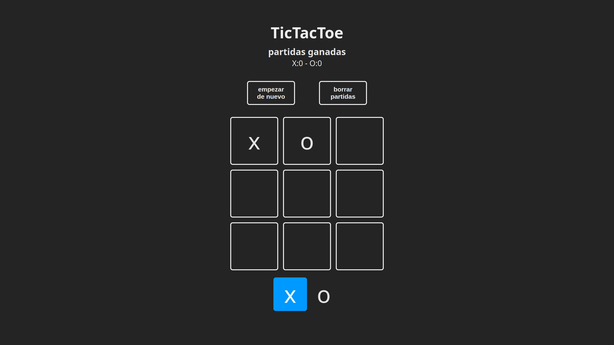

# Tic-Tac-Toe React

> Un juego clásico de Tic-Tac-Toe desarrollado con React.

## 📸 Capturas de Pantalla



## 🚀 Tecnologías Utilizadas

- **React** - Biblioteca de JavaScript para construir interfaces de usuario interactivas.

## 📌 Características

✅ **Modo de juego local**: Juega contra un amigo en el mismo dispositivo.
✅ **Interfaz interactiva**: Uso de React para una experiencia fluida y dinámica.
✅ **Contador de victorias**: Lleva el registro de cuántas partidas ha ganado cada jugador.
✅ **Diseño simple y funcional**: Enfoque en la jugabilidad sin estilos adicionales como TailwindCSS.

## 🛠 Instalación y Uso

1. Clonar el repositorio:
   ```sh
   git clone https://github.com/Hernan-Hernandezz/tictactoe.git
   cd tictactoe
   ```
2. Instalar dependencias:
   ```sh
   pnpm install
   ```
3. Ejecutar el proyecto en desarrollo:
   ```sh
   pnpm dev
   ```
4. Abrir en el navegador:
   ```sh
   http://localhost:3000
   ```

## 📜 Licencia

Este proyecto está bajo la licencia MIT. ¡Siéntete libre de usarlo y mejorarlo!

---

💡 **Contribuciones y feedback son bienvenidos.** ¡Si te gusta el proyecto, no olvides darle una ⭐ en GitHub!
